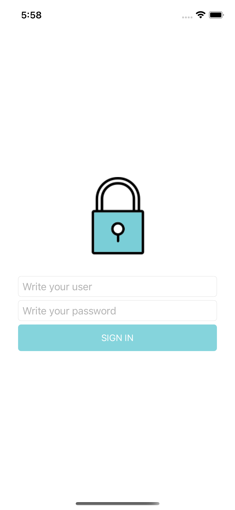
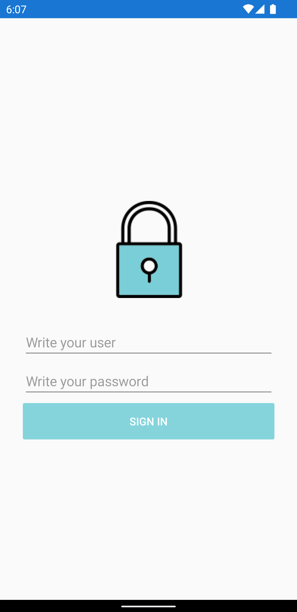

## Content Page
1. Create a new Mobile app using Xamarin Forms project. By default the project will create a MainPage with a ContentPage that would look like this:
``` xml
<?xml version="1.0" encoding="utf-8"?>
<ContentPage 
    xmlns="http://xamarin.com/schemas/2014/forms" 
    xmlns:x="http://schemas.microsoft.com/winfx/2009/xaml" 
    xmlns:local="clr-namespace:ContentPageSample" x:Class="ContentPageSample.MainPage">
    <!-- Here should be a Hello World label -->
</ContentPage>
```
2. Instead of using the default Hello world sample, let's add the following code:
``` xml
<?xml version="1.0" encoding="utf-8"?>
<ContentPage 
    xmlns="http://xamarin.com/schemas/2014/forms" 
    xmlns:x="http://schemas.microsoft.com/winfx/2009/xaml" 
    xmlns:local="clr-namespace:ContentPageSample" x:Class="ContentPageSample.MainPage">
    <StackLayout VerticalOptions="CenterAndExpand"> 
        <StackLayout Padding="30,30">
              <Image Source="Login" Margin="0,30" /> 
              <Entry Placeholder="Write your user" WidthRequest="80"/>
              <Entry Placeholder="Write your password" IsPassword="true"/>
              <Button Text="SIGN IN" BackgroundColor="#85d4dc" TextColor="White"/>
         </StackLayout>
   </StackLayout>
</ContentPage>
```

3. Let's add the file Login.png into each platform
   - For Android: Go to the Android project and Right click the drawable folder inside Resources (if there is not drawable folder, create you can create one) and add the file from Resources within this guide.
   - For iOS: Go to the iOS project and Right click the Resources folder and add the specified image.
4. Run the project, and it should look like this:

| iOS | Android |
| --- | --- |
|  |  |

