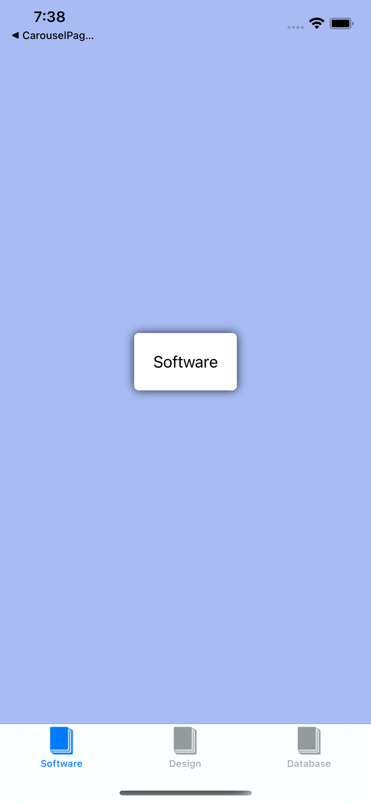
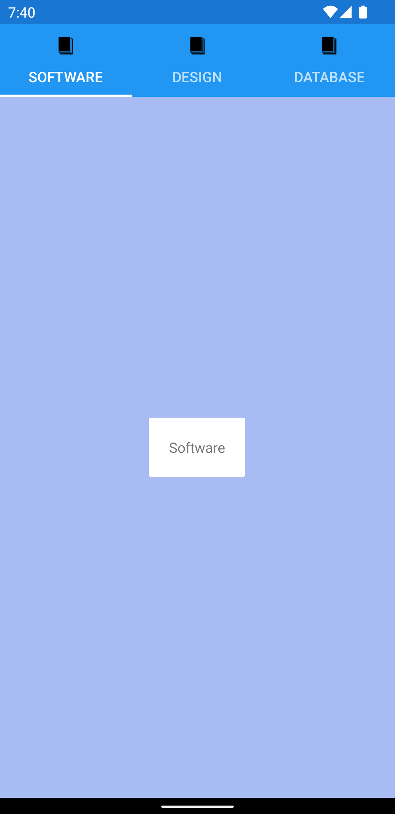

## TabbedPage
1. Create a new Mobile app using Xamarin Forms project.
2. Let's change our MainPage to use a TabbedPage instead of ContentPage, so It look like this:
``` xml
<?xml version="1.0" encoding="utf-8"?>
<TabbedPage xmlns="http://xamarin.com/schemas/2014/forms" 
             xmlns:x="http://schemas.microsoft.com/winfx/2009/xaml" 
             x:Class="TabbedPageSample.MainPage">
      <TabbedPage.Children>
          
      </TabbedPage.Children>
</TabbedPage> 
```

Note: Since We have change the MainPage xaml file to use CarouselPage, You need to change the base class of MainPage.xaml.cs

``` csharp
using Xamarin.Forms;

namespace CarouselPageSample
{
    public partial class MainPage : ContentPage
    {
        public MainPage()
        {
            InitializeComponent();
        }
    }
}
```
To
``` csharp
using Xamarin.Forms;

namespace CarouselPageSample
{
    public partial class MainPage : TabbedPage
    {
        public MainPage()
        {
            InitializeComponent();
        }
    }
}
```

2. Create 3 pages in your Xamarin Forms project: SoftwarePage, DesignPage and DatabasePage. These pages can be Content Pages.

   - SoftwarePage.xaml

   The content of this page should look like this:

``` xml
<?xml version="1.0" encoding="UTF-8"?>
<ContentPage xmlns="http://xamarin.com/schemas/2014/forms" 
             xmlns:x="http://schemas.microsoft.com/winfx/2009/xaml" 
             Title="Software"
             IconImageSource="Icon"
             BackgroundColor="#A8BBF3"
             x:Class="TabbedPageSample.SoftwarePage">
    <ContentPage.Content>
        <StackLayout VerticalOptions="CenterAndExpand"  HorizontalOptions="Center">
            <Frame>
                <Label Text="Software" />
            </Frame>
        </StackLayout>
    </ContentPage.Content>
</ContentPage>
```

   - DesignPage.xaml
   
   The content of this page should look like this:

``` xml
<?xml version="1.0" encoding="UTF-8"?>
<ContentPage xmlns="http://xamarin.com/schemas/2014/forms" 
             xmlns:x="http://schemas.microsoft.com/winfx/2009/xaml" 
             Title="Design"
             IconImageSource="Icon"
             BackgroundColor="#F3A8EE"
             x:Class="TabbedPageSample.DesignPage">
    <ContentPage.Content>
        <StackLayout VerticalOptions="CenterAndExpand"  HorizontalOptions="Center">
            <Frame>
                <Label Text="Design" />
            </Frame>
        </StackLayout>
    </ContentPage.Content>
</ContentPage>
```

   - DatabasePage.xaml

   The content of this page should look like this:

``` xml
<?xml version="1.0" encoding="UTF-8"?>
<ContentPage xmlns="http://xamarin.com/schemas/2014/forms" 
             xmlns:x="http://schemas.microsoft.com/winfx/2009/xaml" 
             Title="Database"
             IconImageSource="Icon"
             BackgroundColor="#C5F3A8"
             x:Class="TabbedPageSample.DatabasePage">
    <ContentPage.Content>
         <StackLayout VerticalOptions="CenterAndExpand"  HorizontalOptions="Center">
            <Frame>
                <Label Text="Database" />
            </Frame>
        </StackLayout>
    </ContentPage.Content>
</ContentPage>
```

3. Let's go back to our MainPage.xaml, add a namespace in our Xaml file to access the pages We've created:

``` xml
<?xml version="1.0" encoding="utf-8"?>
<!-- Let's add xmls:local with the namespace We need to access, in this sample: TabbedPageSample -->
<TabbedPage xmlns="http://xamarin.com/schemas/2014/forms" 
             xmlns:x="http://schemas.microsoft.com/winfx/2009/xaml" 
             xmlns:local="clr-namespace:TabbedPageSample" 
             x:Class="TabbedPageSample.MainPage">

      <TabbedPage.Children>
          
      </TabbedPage.Children>
</TabbedPage> 
```

4. Add our pages into the TabbedPage.Children tag:

``` xml
<?xml version="1.0" encoding="utf-8"?>
<TabbedPage xmlns="http://xamarin.com/schemas/2014/forms" 
             xmlns:x="http://schemas.microsoft.com/winfx/2009/xaml" 
             xmlns:local="clr-namespace:TabbedPageSample" 
             x:Class="TabbedPageSample.MainPage">

      <TabbedPage.Children>
          <local:SoftwarePage />
          <local:DesignPage />
          <local:DatabasePage />
      </TabbedPage.Children>

</TabbedPage> 
```

Our app should look like this:

| iOS | Android |
| --- | --- |
|  |  |

Note: Don't forget to add the Icon.png image in both Android and iOS projects.